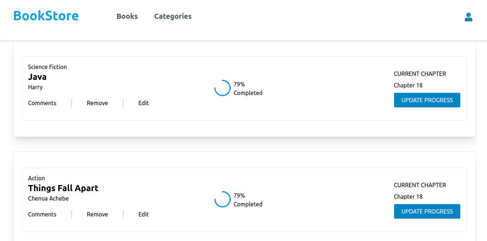

## Book Store
> **Book Store is a website that is used to Add, Display, Remove and Update Book, Its very much simillar to my Awesome Book Project built with different framework**

## Built With

- JavaScript ( ES6, Webpack, JEST)
- HTML5 ( Semantics )
- Tailwind CSS
- React
- Redux

## Live Demo

[**Here 🚀**](https://alusine-jalloh-book-store.netlify.app/)

## Video Demonstration

[** Watch 😄 **](https://drive.google.com/file/d/1fwDNwqgGSCS1jN-kcN9urNWYLAgeol1T/view?usp=sharing)

## Screenshots 

## Getting Started

To get a local copy up and running follow these simple example steps. Please make sure on order to use the this project you need to install all dependencies.

### Prerequisites

- In order to explore this repository, you must have a good knowledge on HTML5 - semantics, CSS and JavaScript with ES6 and webpack.

### Setup

- Use the below command for taking clone this project

  `git clone https://github.com/Alusp/meals-capstone-project.git`

### Install

- Make sure that you have already downloaded the `node` and `npm` on your system. If yes, then install the 
  packages by using below command.
  
  `npm i`

### Usage

- You can simply use run-server vscode extension to run this website on your local browser.

### Run tests

I have added the linters or tests in order to avoid anykind of typos and ensure the good practices in this project. So while using this repository if you need to check your work no matters have worked on html, css and js you can use below commands

- In order to run the linter test on `index.html` or any html file. Use below command

  `npx hint .`

- To run linter test on stylesheets. Use below command

  `npx stylelint "**/*.{css,scss}"`

- To run linter test on javascript files. Use below command

  `npx eslint .`

- To run the development server use below command

  `npm start`

- To create build file. Use below command

  `npm run build`

- To run the JEST Test below command

  `npm run test`

## Author

👤 **Alusine Jalloh**

- GitHub: [@Alusp](https://github.com/Alusp)
- LinkedIn: [@alusine-jalloh](https://www.linkedin.com/in/alusine-jalloh)
- Twitter: [@aseni_jalloh](https://twitter.com/aseni_jalloh)

 
## 🤝 Contributing

Contributions, issues, and feature requests are welcome!

Feel free to check the [issues page](../../issues/).

## Show your support

Give a ⭐️ if you like this project!

## 📝 License

This project is [MIT](./MIT.md) licensed.
